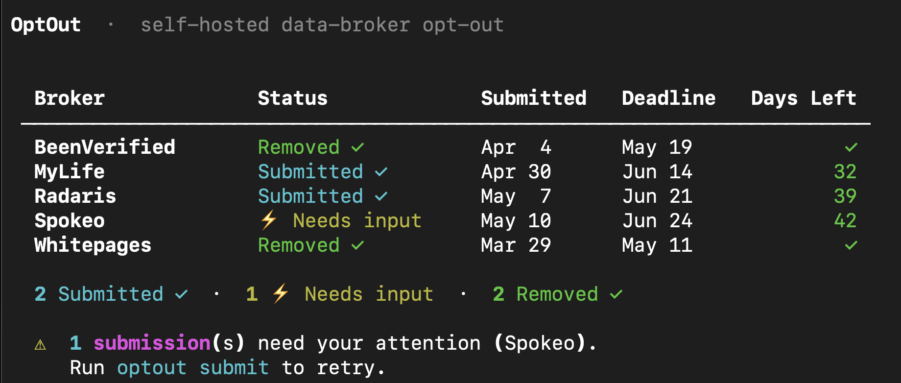
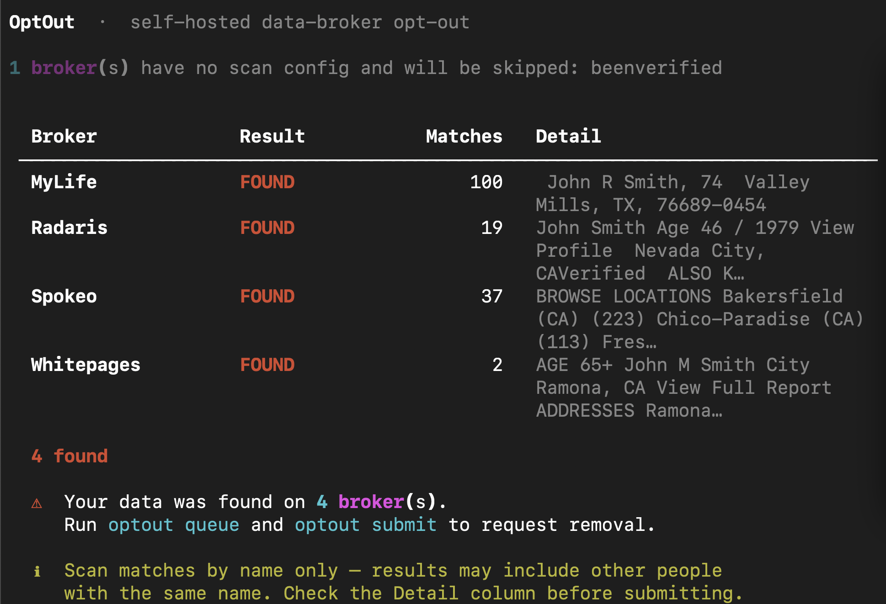
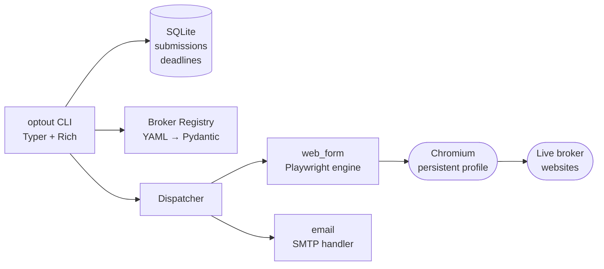

# OptOut

**Self-hosted CLI that automates CCPA/CPRA data-broker opt-out requests.**

[](https://github.com/Blake104/OptOut/actions/workflows/ci.yml)
[](https://pypi.org/project/optout/)
[](https://pypi.org/project/optout/)
[](https://www.gnu.org/licenses/agpl-3.0)

---





---

## Why this exists

CCPA and CPRA give California residents the right to demand deletion of their data from any company that sells it. Data brokers — Whitepages, BeenVerified, Spokeo, and dozens more — are legally required to comply. They also make exercising that right as hostile as possible: a different form on every site, CAPTCHAs, phone verification calls, 45-day deadlines you have to track manually, and data that silently reappears 60–90 days later.

OptOut automates the hostile parts. You run it on your own machine with your own information. There is no central server, no account, no SaaS subscription — which means the "authorized agent" legal complexity that DeleteMe and Optery have to navigate simply does not apply.

---

## Install

```bash
pipx install optout
playwright install chromium   # one-time browser download (~130 MB)
optout init                   # interactive setup wizard
```

> **Requirements:** Python 3.12+, [pipx](https://pipx.pypa.io/), [Playwright](https://playwright.dev/python/)

---

## Quickstart

```bash
optout init                      # create ~/.config/optout/config.yml
optout queue                     # add all brokers to the submission queue
optout submit                    # open Chrome, walk each broker's form
optout status                    # table of deadlines and statuses
optout monitor                   # re-scan; re-queues brokers that re-added you
```

`optout submit` opens a real Chrome window for each broker. It fills every form field it can, then pauses with a prompt when human action is needed (CAPTCHA, listing selection, phone verification).

---

## Supported brokers

| Broker | Method | Automation | Human steps | Last verified |
|--------|--------|-----------|-------------|---------------|
| [BeenVerified](https://www.beenverified.com) | Web form | Partial | Click your listing; solve Turnstile CAPTCHA | 2026-05-10 |
| [MyLife](https://www.mylife.com) | Web form | Partial | Solve reCAPTCHA; click Submit | 2026-05-10 |
| [Radaris](https://radaris.com) | Web form | Mostly automated | Click your listing; click "Start Removing"; click confirmation email | 2026-05-12 |
| [Spokeo](https://www.spokeo.com) | Web form | Partial | Click your listing; solve reCAPTCHA; click confirmation email | 2026-05-12 |
| [Whitepages](https://www.whitepages.com) | Web form | Partial | Click your listing; answer phone call; enter verification code | 2026-05-10 |

All five brokers are verified end-to-end as of 2026-05-12. New brokers are added as YAML files — no Python required. See [CONTRIBUTING.md](CONTRIBUTING.md).

---

## How it works

OptOut reads broker definitions from YAML files bundled with the package. Each YAML declares the broker's opt-out URL, required fields, and a list of steps. The engine walks those steps using a persistent Playwright Chromium context, so Cloudflare Turnstile cookies survive between runs and you only solve those challenges once.



Submissions are tracked in a local SQLite database. `optout status` surfaces anything overdue. `optout monitor` re-scans and re-queues automatically — safe to run from cron.

---

## Commands

```
optout init                          # interactive setup wizard
optout doctor                        # check that everything is installed correctly
optout brokers list [--category]     # list all known brokers
optout brokers info <slug>           # details + your submission history
optout scan    [--broker SLUG]       # check which brokers list you (no submissions made)
optout queue   [--broker SLUG]       # add brokers to the submission queue
optout submit  [--broker SLUG] [-v]  # process the queue; -v shows debug output
optout status  [--broker] [--status] # table of submissions and deadlines
optout monitor                       # one-shot re-scan (cron-friendly)
```

---

## Configuration

`optout init` writes `~/.config/optout/config.yml` (mode `600`). Key sections:

```yaml
profile:
  legal_name: "Jane Q Public"
  dob: "1990-05-14"
  current_address:
    street: "123 Main St"
    city: "Austin"
    state: "TX"
    zip: "78701"
  emails:
    current: ["jane@example.com"]
  phones:
    current: ["+15125551234"]

email:
  method: smtp
  smtp:
    host: smtp.gmail.com
    port: 587
    username: jane@example.com
    password_env: OPTOUT_SMTP_PASSWORD   # read from env, never stored in file

playwright:
  headless: false    # keep false so you can solve CAPTCHAs
  slow_mo_ms: 0
```

Runtime data lives at:

| Path | Contents |
|------|----------|
| `~/.config/optout/config.yml` | Your profile and settings |
| `~/.config/optout/browser_profile/` | Persistent Chrome profile (keeps Cloudflare cookies warm) |
| `~/.local/share/optout/optout.db` | SQLite — submissions, events, scan history |
| `~/.local/share/optout/artifacts/` | Confirmation screenshots |

---

## Adding a broker

New brokers are a single YAML file — no Python needed. Five steps:

**1. Verify the opt-out flow manually** in a real browser. Note every field, selector, and verification step.

**2. Copy the nearest template:**
```bash
cp src/optout/data/brokers/radaris.yml src/optout/data/brokers/new-broker.yml
```

**3. Fill in the metadata** — `slug`, `name`, `domain`, `method`, `opt_out_url`, `legal_basis`, `statutory_response_days`.

**4. Write the steps** — each step is a `type` (`navigate`, `form_fill`, `click`, `wait_for`, `prompt_user_if_present`, `capture`) with the relevant CSS selectors.

**5. Validate:**
```bash
uv run pytest tests/test_production_brokers.py -v
```

Full step reference and template variables are in [CONTRIBUTING.md](CONTRIBUTING.md).

---

## Honest limitations

- **Removal is not guaranteed.** Some brokers comply in days; others take the full 45-day window or ignore requests.
- **Data reappears.** 60–90 days is typical. Run `optout monitor` monthly to catch this.
- **CAPTCHAs require a human.** The tool pauses and prompts — no CAPTCHA solving, by design.
- **Broker forms change.** When a broker redesigns their opt-out page, the YAML selectors need updating. Use `debug_elements.py` locally to find the new selectors.
- **Phone verification is manual.** Whitepages calls your phone; you enter the code. The tool waits.

---

## Legal basis

OptOut cites the applicable statute in every submission:

- **CCPA §1798.105** — right to deletion, 45-day response window
- **CPRA** — extends CCPA with stronger enforcement
- **GDPR Art. 17** — right to erasure, 30-day response window

Each broker's YAML declares which statutes apply. See [COMPLIANCE.md](COMPLIANCE.md) for the full legal posture.

---

## License

AGPL-3.0-only. See [LICENSE](LICENSE).

This license was chosen intentionally: anyone who forks this and runs it as a hosted service must publish their changes. The project's legal model depends on each user running their own copy.
